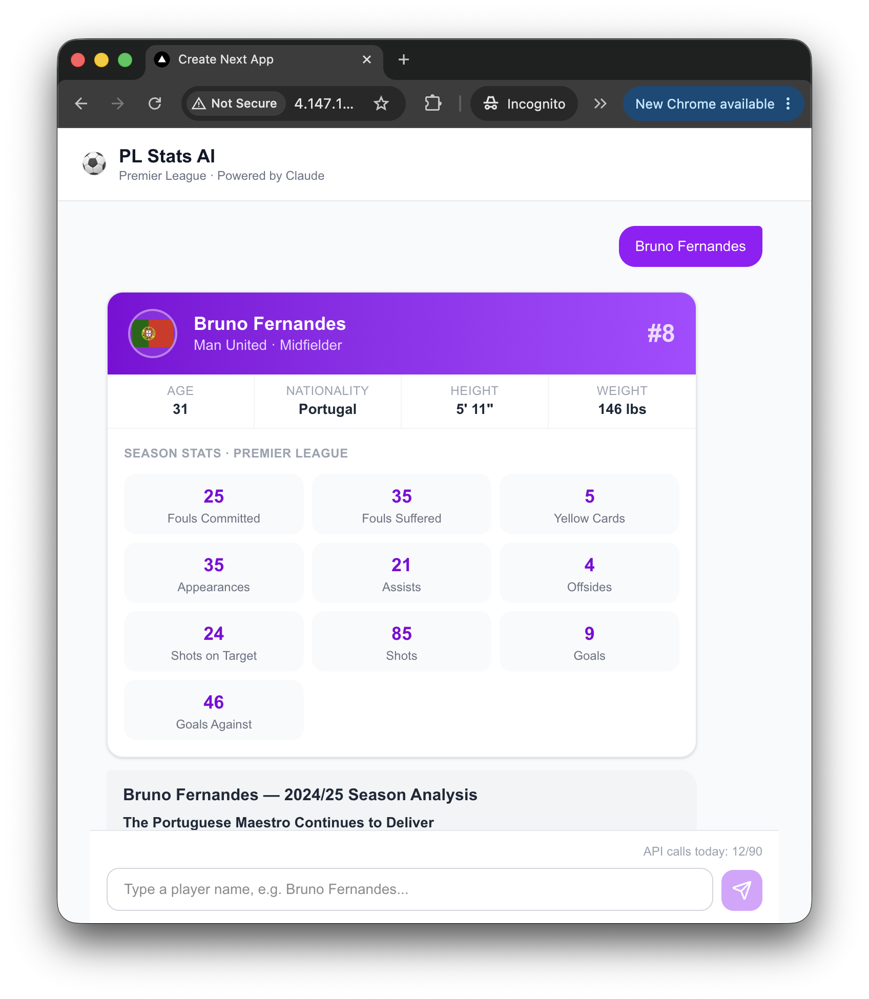
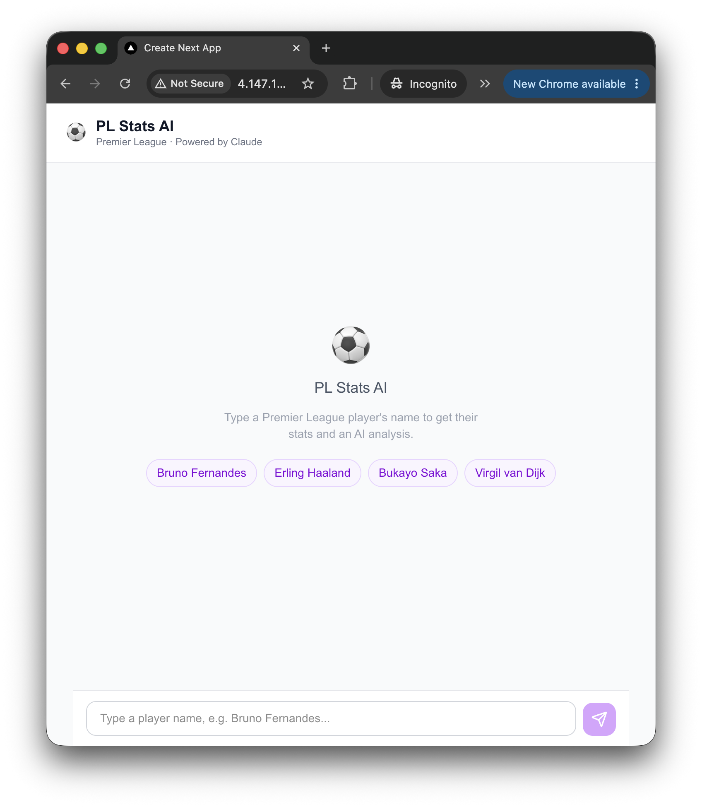
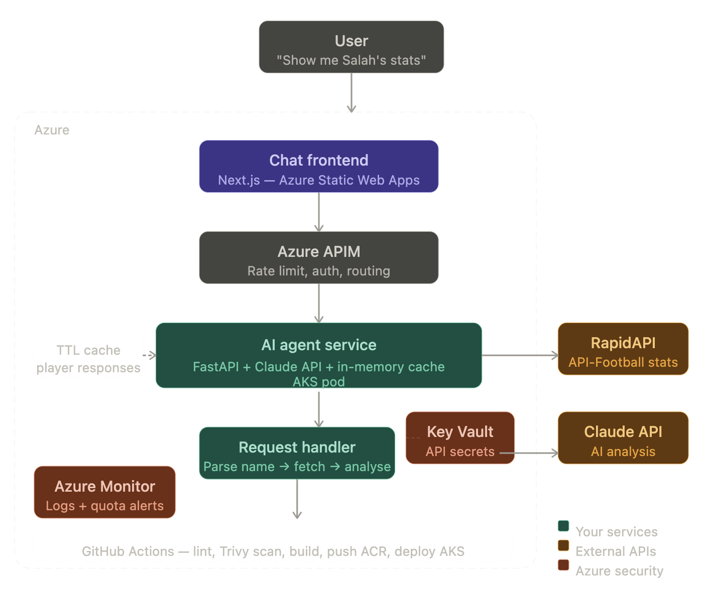

# 🤖 Agent PL Player Stats

An AI-powered Premier League player stats chatbot deployed on Azure.
Type any player's name and get real-time stats with a Claude AI pundit analysis.

**Live demo:** http://4.147.108.223

<p align="center">
  
</p>

---

## What it does

- Fetches live Premier League player stats from ESPN via RapidAPI
- Sends stats to Claude (Anthropic) for natural language pundit-style analysis
- Displays a player card with season stats, bio, and AI verdict
- Caches results for 1 hour to protect the free API quota (100 calls/day)

---

## Demo

<p align="center">
  
</p>

> Type a player name or click a quick-select button to get started.

<p align="center">
  
</p>

> The app returns a player card with season stats and a Claude AI analysis.

---

## Architecture

<p align="center">
  
</p>


## Tech stack

| Layer | Technology |
|---|---|
| Frontend | Next.js 16, Tailwind CSS |
| AI Agent | FastAPI, Python 3.13, Anthropic Claude |
| Container orchestration | Kubernetes (AKS) |
| Container registry | Azure Container Registry (ACR) |
| Secrets management | Azure Key Vault + Managed Identity |
| Infrastructure as Code | Terraform |
| CI/CD | GitHub Actions |
| Observability | Azure Monitor + Log Analytics |

---

## Project structure

```
pl-stats-platform/
├── agent/                  # FastAPI AI agent
│   ├── src/pl_stats/
│   │   ├── api_client.py   # RapidAPI client with TTL cache
│   │   ├── agent.py        # Claude AI analysis
│   │   ├── cache.py        # Quota protection cache
│   │   └── main.py         # FastAPI app
│   ├── tests/              # pytest unit tests
│   └── Dockerfile          # Multi-stage, non-root
├── frontend/               # Next.js chat UI
│   ├── app/
│   │   ├── components/     # Chat, PlayerCard
│   │   └── api/chat/       # Server-side proxy to agent
│   └── Dockerfile          # Multi-stage standalone
├── infra/
│   ├── docker/             # Local docker-compose
│   └── terraform/          # Azure infrastructure as code
└── k8s/                    # Kubernetes manifests
├── agent/                  # Deployment, Service, HPA
└── frontend/               # Deployment, Service (LoadBalancer)
```

---

## Local development

**Prerequisites:** Docker Desktop, Python 3.13+, Node.js 20+

```bash
# 1. Clone the repo
git clone https://github.com/justinvu-au/Agent-PL-Player-Stats
cd Agent-PL-Player-Stats

# 2. Set up environment variables
cp .env.example .env
# Edit .env and fill in your API keys

# 3. Run full stack with Docker Compose
docker compose -f infra/docker/docker-compose.yml up

# 4. Open the app
open http://localhost:3000
```

---

## Azure deployment

**Prerequisites:** Azure CLI, Terraform, kubectl, Docker Desktop

```bash
# 1. Provision Azure infrastructure
cd infra/terraform
terraform init
terraform apply

# 2. Store secrets in Key Vault
az keyvault secret set --vault-name plstats-kv --name rapidapi-key --value "YOUR_KEY"
az keyvault secret set --vault-name plstats-kv --name anthropic-api-key --value "YOUR_KEY"

# 3. Connect kubectl to AKS
az aks get-credentials --resource-group pl-stats-rg --name plstats-aks

# 4. Build and push images (Apple Silicon → linux/amd64)
az acr login --name plstatsacr
docker build --platform linux/amd64 -t plstatsacr.azurecr.io/pl-stats-agent:v1 ./agent
docker build --platform linux/amd64 -t plstatsacr.azurecr.io/pl-stats-frontend:v2 ./frontend
docker push plstatsacr.azurecr.io/pl-stats-agent:v1
docker push plstatsacr.azurecr.io/pl-stats-frontend:v2

# 5. Create Kubernetes secret from Key Vault
kubectl create secret generic pl-stats-secrets \
  --from-literal=rapidapi-key="$(az keyvault secret show --vault-name plstats-kv --name rapidapi-key --query value -o tsv)" \
  --from-literal=anthropic-api-key="$(az keyvault secret show --vault-name plstats-kv --name anthropic-api-key --query value -o tsv)"

# 6. Deploy to AKS
kubectl apply -f k8s/agent/
kubectl apply -f k8s/frontend/
kubectl get pods -w
```

---

## DevSecOps highlights

**Secrets management**
API keys are stored in Azure Key Vault and injected into pods at runtime via Managed Identity. Zero secrets in source code, Docker images, or Kubernetes manifests.

**Container security**
Multi-stage Dockerfiles with non-root users reduce the attack surface. Trivy scans every image in CI and blocks deployment on critical CVEs.

**Autoscaling**
HorizontalPodAutoscaler scales the agent from 1 to 3 pods when CPU exceeds 70%, then scales back down automatically.

**Infrastructure as Code**
All Azure resources (AKS, ACR, Key Vault, Log Analytics) are defined in Terraform. The full environment can be reproduced in under 10 minutes with `terraform apply`.

**Quota protection**
In-memory TTL cache limits RapidAPI to one call per player per hour. A daily counter rejects requests above 90 calls with a clear error message. Monitor live usage at `/api/health`.

---

## Cost management

The AKS node costs ~$0.10/hr. Stop it when not in use:

```bash
# Stop the cluster (saves ~$70/month)
az aks stop --name plstats-aks --resource-group pl-stats-rg

# Restart when needed
az aks start --name plstats-aks --resource-group pl-stats-rg

# Scale pods to zero without stopping the node
kubectl scale deployment pl-stats-agent --replicas=0
kubectl scale deployment pl-stats-frontend --replicas=0
```

---

## Running tests

```bash
cd agent
source ../.venv/bin/activate
python -m pytest tests/ -v
```

All external API calls (RapidAPI, Anthropic) are mocked — tests run without consuming quota.

---

## Environment variables

| Variable | Description |
|---|---|
| `RAPIDAPI_KEY` | RapidAPI key for english-premiere-league1 API |
| `ANTHROPIC_API_KEY` | Anthropic API key for Claude |

See `.env.example` for the full template.

---

## Built with

- [Anthropic Claude](https://anthropic.com) — AI analysis
- [API-Football / English Premier League API](https://rapidapi.com/belchiorarkad-FqvHs2EDOtP/api/english-premiere-league1) — player stats
- [Azure Kubernetes Service](https://azure.microsoft.com/en-au/products/kubernetes-service) — container orchestration
- [Terraform](https://www.terraform.io) — infrastructure as code
- [Next.js](https://nextjs.org) — frontend framework
- [FastAPI](https://fastapi.tiangolo.com) — Python API framework


